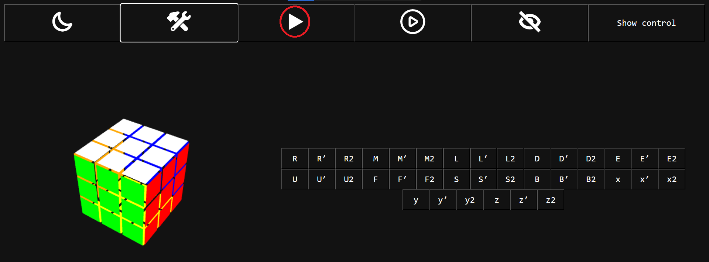
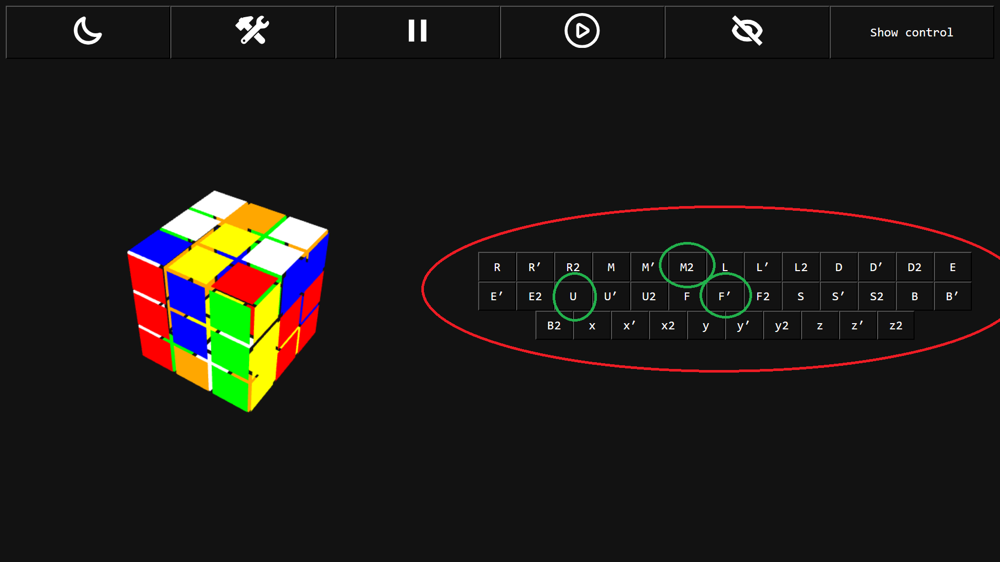
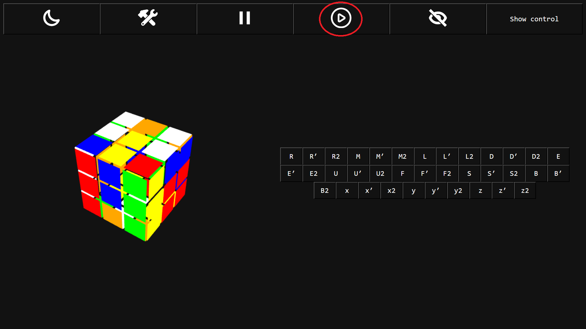
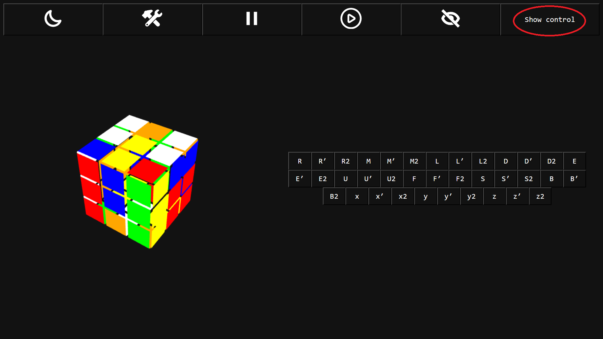
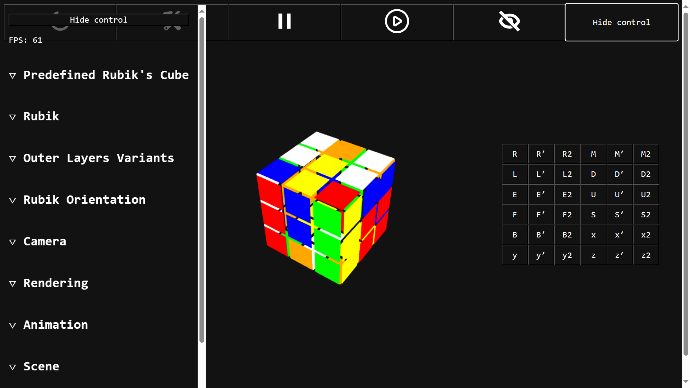
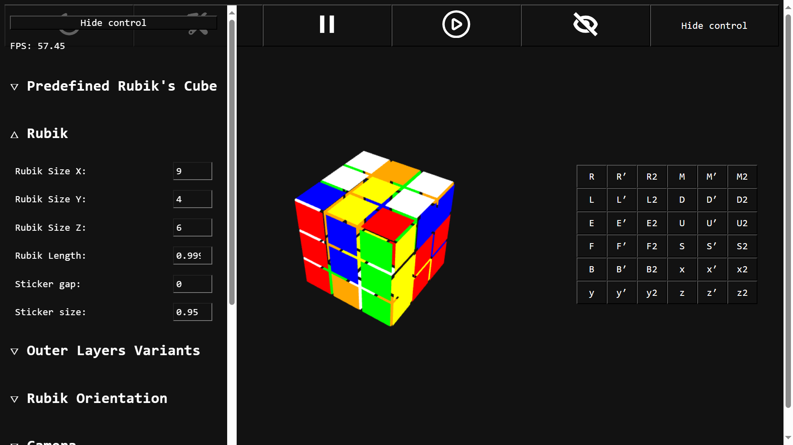
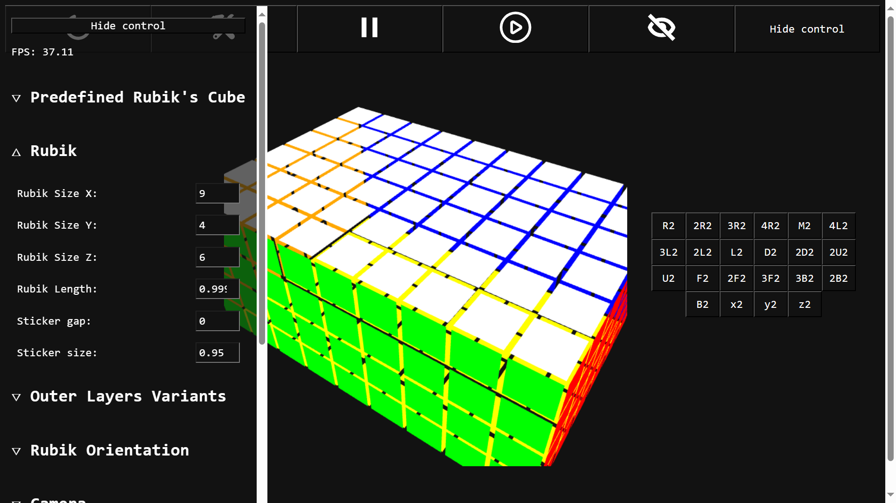
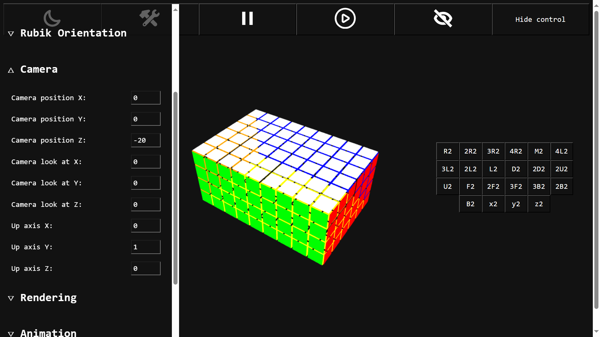

# A Rubik's Cube Simulator

## Technologies
- HTML, CSS for GUI
- JavaScript for logic
- WebGL API for rendering Rubik's Cube and apply rubik's cube movement, transition, rotation, camera and scene

## Knowledges
- Basic knowlegde of HTML, CSS and JavaScript
- Basic knowledge of 
  - WebGL API
  - Perspective, clipping planes, field of view, far place, near place
  - matrix, identity matrix, transformation matrix, rotation matrix

## Feature
- Create Custom functional 3D rubik's cube at any size (2x2x2, 3x3x3, 4x4x4, 11x2x5, 4x5x9, etc)
- Multiple render option (outer layer, inner cubes, inner planes, changing point size, etc)
- Each color of 6 layers can be changed with hex color
- Customizable Camera Properties (camera position in 3d, position for camera to look at in 3d)
- Customizable Rubik's Cube orientation and position
- Customizable Scene (Field of View, near plane, far plane)

## How to use

### Step 1: Go to this page:  [here](https://leetrongjnghiax.github.io/WebGL_Rotating_Cube_2/)

### Step 2: Click on the circled button in the image below

### Step 3: Click on the circles button in the image below to enable scrambling mode

### Step 4: You can now scrambling the Rubik's Cube using the list of button circled in the image below. For example, to rotate top face 90 degrees clockwise, press "U". To rotate front face 90 degress counter clockwise press "F'". To rotate middle layer 180 degress, press "M2"

Or you can press circled button in the image below to enable Auto Pilot Mode - the rubik will start scrambling on its own

Enjoy!

## Customizable Stuff

### You can press "Show control" button to open the drawer on the left side of the screen. This drawer contain more option that you can change to custom your Rubik's Cube

This drawer contain these options:

- Rubik: Allow you to change the rubik's size (After each change, you need to folow step 2 again in order for these change to take effect)

If the image is to biyou can go to camera section and decrese camera position z for better viewing (remember to do step 2 each change)

And much more!